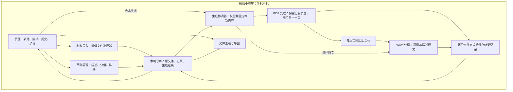

# 初版技术设计 v0.1

- 日期：2026-09-07
- 需求依据：[需求与验收说明 v0.1](requirements.md)
- 配套方案：[工程初始化方案 v0.1](initialization-plan.md)
- 状态：业务首版已实现，电脑文件流程测试与微信页面编译通过；Android 基础首页已确认，新增业务真机验证待开展。当前证据见 [验证记录](validation.md)
- 阅读约定：“设计决定”表示本项目选择的方向；“优先验证”表示已有资料依据，实际兼容性仍待检查

## 1. 设计目标与当前决定

用户在手机上导入材料、编辑费用组、生成 PDF 和 Word，并从本机历史记录继续编辑。首版的应用代码、材料处理和记录保存围绕微信小程序本机能力组织。

当前设计决定：

1. 采用微信原生小程序，使用 TypeScript、WXML 和 WXSS。TypeScript 为数据和函数提供类型检查；例如检查费用组是否具有描述字段。WXML 描述页面结构，WXSS 描述页面样式。
2. 原材料与生成结果保存到小程序本机文件空间，记录信息保存为 JSON。JSON 是程序可读的数据文本，例如一条记录的创建时间、费用组顺序和材料路径。
3. 发票图片转换、PDF 页面合并和 Word 生成统一放到“生成”操作中。导入阶段保存原文件与编辑信息。
4. 当前实现固定采用 pdf-lib 1.17.1、Docxtemplater 免费核心 3.69.3 与 PizZip 3.2.0。电脑真实文件生成已通过，手机兼容性继续验证。
5. 第一轮兼容性结论限定为所测 Android 设备和微信版本。iOS 兼容性留待补充验证。

## 2. 系统架构与数据流

### 本轮实现补充

- `core/` 负责共同格式、校验、清单备份和生成事务；`services/` 将这些规则连接微信文件系统、文件选择、文档打开与分享。页面共用这些入口。
- 为减少手动构建步骤，`scripts/build.cjs` 使用 esbuild 生成 `miniprogram/vendor/documents.js`，保留依赖许可证。无需微信手动“构建 npm”。候选比较见 [实施记录](implementation-notes.md)。
- PageRange 增加生成时的 `description`，ExportRecord 增加生成时的 `title` 和 `pageCount`；旧结果显示自己的描述和标题。此补充保证修改草稿后，上次导出仍有完整解释。
- 清单写入为短小同步操作，文本输入延迟 350 毫秒保存，页面隐藏或离开时立即提交。原材料复制和生成文件读写采用异步 API。
- 历史读取入口 `Repository.list()` 使用 `hasReportContent()` 判断记录是否有用户填写的标题、组描述、发票／附件引用或已有导出结果。完全空白记录在历史列表中过滤；默认时间和空白组不计为内容。新建记录仍可在编辑页使用相同 ID，读取历史时保留底层原文件及备份，避免中断尚在编辑的记录。此规则同时适用于升级前的空记录。
- 内部项目共用 `hasGroupContent()` 判断描述和材料是否为空。报销列表 `onShow`、新增和生成入口通过 `Repository.removeEmptyGroups()` 清理空组条目，继续使用原有备份与原子保存流程；材料文件和 `lastExport` 保留。历史列表的项目数也过滤空组，排序和页码以清理后的组为准。
- 单项编辑的 `onHide` / `onUnload` 负责提交文本；空项目清理在回到报销列表时执行，避免打开材料选择器或切后台时删除正在填写的组。`services/materials` 登记选择和导入中的组 ID，完成、取消或异常后释放；清理跳过这些组，生成操作提示等待导入完成。
- “保存并添加下一项”调用 `Repository.nextGroup()`：当前空白则沿用该组并清空空白字符，已有内容则新建下一组。导入结束时，已卸载编辑页停止刷新自身。
- 图片当前覆盖 JPG/JPEG、PNG；以 A4 留白并保持比例。原 PDF 页面尺寸和页面顺序保留。其他图片格式、大体积输入、照片旋转与 Android 内存上限仍需实机验证。
- 当前保留旧原材料和导出版本以保护用户内容。长期本机空间管理仍待容量验证，避免将此版称为长期运营验收完成。



生成协调器负责按顺序调用处理步骤。它在本机运行，使用同一份费用组顺序生成两份文件。

例如，两页发票加两张附件图片占第 1—4 页。PDF 处理模块返回这个页码范围，Word 模块据此填写“第 1—4 页：用户描述原文”。费用组改变顺序后，两份文件使用重新计算的页码。

## 3. 模块分工与统一数据约定

### 3.1 模块分工

| 模块 | 负责什么 | 交给下一步的数据 |
|---|---|---|
| 页面与交互 | 首页、独立历史页、报销列表、费用组编辑、生成结果；处理返回和拖拽动作 | 用户修改和操作指令 |
| 微信能力适配 | 调用微信选择文件、读取和写入文件、打开和转发文件的接口 | 已保存的文件引用，或具体失败信息 |
| 草稿与记录仓库 | 管理费用组、材料顺序、描述和本机保存；读取历史记录 | 一份完整报销记录 |
| 生成协调器 | 检查必填材料、固定本次内容、依次生成两份文件、记录结果 | 一次成功生成的结果，或失败位置 |
| PDF 适配器 | 将原材料转换为有序页面，并统计每组页码 | PDF 二进制内容和页码范围表 |
| Word 适配器 | 将页码范围和用户描述填入固定模板 | Word 二进制内容 |

适配器就是把外部工具接到本项目上的小模块。例如替换 PDF 库时，优先修改 PDF 适配器，页面仍使用相同的生成入口。

### 3.2 共同使用的数据

以下字段是后续模块共同遵守的初版约定。具体类型定义将在工程中集中放置。

| 对象 | 必要字段 | 约定 |
|---|---|---|
| 报销记录 `Reimbursement` | `schemaVersion`、`id`、`createdAt`、`updatedAt`、`title`、`revision`、`groups`、`assets`、`lastExport` | 标题可为空；`createdAt` 用于历史记录归类；`revision` 标记内容版本 |
| 费用组 `ExpenseGroup` | `id`、`description`、`invoiceIds`、`attachmentIds` | 两个材料数组分别记录发票和附件的顺序；描述保存用户原文 |
| 原材料 `Asset` | `id`、`kind`、`originalName`、`relativePath`、`size` | `kind` 为 PDF 或图片；保存仓库内相对路径，临时选择路径只用于导入 |
| 页码范围 `PageRange` | `groupId`、`startPage`、`endPage` | 对应最终凭证 PDF 的物理页序，从 1 开始 |
| 生成结果 `ExportRecord` | `generationId`、`sourceRevision`、`generatedAt`、`pdfPath`、`wordPath`、`ranges` | PDF、Word 和页码表属于同一次生成；首次生成前可为空 |

费用组和材料使用稳定标识。拖拽时修改数组顺序，标识保持原值。各模块使用同一份数组顺序，避免显示顺序与导出顺序分离。

描述的空白检查与内容保存分别处理：判断必填项时检查是否只有空白；写入 Word 时使用保存的原文。数据格式通过 `schemaVersion` 标明版本，格式升级时保留旧记录的读取或迁移路径。

### 3.3 模块之间的输入与输出

| 操作 | 输入 | 输出 |
|---|---|---|
| 导入材料 | 目标记录、目标费用组、发票或附件区域 | 成功保存的 `Asset` 列表及失败项 |
| 保存草稿 | 修改后的 `Reimbursement` | 已保存记录及其版本 |
| 生成 PDF | 固定版本的记录与原材料读取能力 | PDF 字节数据及 `PageRange[]` |
| 生成 Word | 同一版本的描述与 `PageRange[]` | Word 字节数据 |
| 提交生成结果 | 两份已写入的文件、记录版本、页码表 | `ExportRecord` |

二进制处理优先使用 `Uint8Array` 或 `ArrayBuffer`，即直接保存文件字节的对象。微信文件接口与通用库之间的格式转换集中放在适配器中。

## 4. 用户操作对应的实现路径

### 4.1 导入与本机历史

微信官方定义提供 `wx.chooseMessageFile` 从客户端会话选择文件；文件系统提供复制和读写能力；`wx.openDocument` 包含 PDF、DOCX 类型；`wx.shareFileMessage` 提供文件转发入口。初版使用这些能力，实际操作表现纳入真机验证。依据：[微信官方 API 定义](https://github.com/wechat-miniprogram/api-typings/blob/master/types/wx/lib.wx.api.d.ts)。

1. 用户通过微信系统选择器主动选择材料。程序的读取范围是选择器实际返回的文件。
2. 导入模块复制原材料到本记录的文件目录，复制成功后保存材料引用。期间保持原文件内容。
3. 页面使用材料引用展示已有材料。用户保存费用组时，仓库保存描述和顺序。
4. 历史页读取本机记录，按创建日期和时间组织展示；打开记录时恢复原材料引用和费用组顺序。

建议本机布局：

```text
wx.env.USER_DATA_PATH/
└── reimbursements/
    └── <record-id>/
        ├── project.json             # 描述、顺序、材料引用、最近一次生成信息
        ├── originals/               # 原始 PDF 与图片
        └── exports/<generation-id>/ # 一次生成的 PDF 与 Word
```

本机历史以原材料和编辑信息为重新生成的依据。写入记录采用临时文件、读取核验和提交步骤，并保留最近可用记录供失败恢复；文件替换行为需在实际运行环境验证。同一记录的写入串行处理，避免两个保存操作相互覆盖。

微信数据清理、卸载或设备变更可能影响本机数据保留。首版的历史可恢复范围是当前设备仍然保留的小程序数据。容量和持续保留表现属于验证项目。

### 4.2 PDF 与 Word 生成

1. 校验至少存在一组费用，并逐组检查发票、描述和原材料可读性。缺失项定位到具体费用组和文件。
2. 固定本次生成的记录版本与材料顺序。生成期间限制同一条记录的重复生成和编辑，完成或失败后恢复操作。
3. 按费用组顺序处理；每组依次读取发票数组和附件数组。已有 PDF 按原顺序复制页面；图片在生成阶段转换为独立页面。
4. 图片页的初版排版默认值为 A4、等比完整放置、保留页边距。原 PDF 使用其原有页面尺寸。长图、横图及细小文字的可读性在样例验证后复核。
5. 每组完成时，以实际已写入的页数计算起止页码。PDF 内已有的印刷页码与这里的物理页序分别处理。
6. 使用固定 Word 模板生成 `.docx`；每组写入页码范围和描述原文，保留描述换行并正确处理特殊字符。
7. 两份文件写入成功后，提交本次生成信息。新生成失败时，保留原材料、编辑内容和上次成功结果。
8. 修改材料、描述或顺序后，结果版本与草稿版本发生变化。界面提示重新生成；历史产物通过对应版本识别。

PDF 处理按材料逐份读取，减少同时持有的输入字节。最终文档仍会占用内存，因此处理页数、图片分辨率和总文件大小的可用范围以真机测量为依据。

### 4.3 查看、导出与失败处理

查看和导出由用户主动点击触发。查看交给微信文档打开接口；导出优先验证微信文件转发接口的实际表现。导出成功的判定与用户取消分别处理。

遇到缺失、损坏、加密或当前处理器无法读取的材料时，显示具体文件与原因，保留草稿供用户替换后重试。导出阶段失败时保留已经生成的本机文件。原文件持续保存，页面合并结果的兼容性通过渲染和打开检查确认。

## 5. 现有代码搜索与筛选记录

本轮检索完成于 2026-09-06 至 2026-09-07。检查了官方仓库、示例、包配置和关键源码入口。部分微信文档网页读取失败，接口依据使用微信官方仓库中随文档生成的 API 定义。以下均属于资料与源码检查，实际安装和运行结果待记录。

### 5.1 工程基础

| 候选 | 已检查的依据 | 本项目判断 |
|---|---|---|
| 微信原生小程序 | [官方示例](https://github.com/wechat-miniprogram/miniprogram-demo)、[项目配置源码](https://github.com/wechat-miniprogram/miniprogram-demo/blob/master/project.config.json)、[官方类型定义](https://github.com/wechat-miniprogram/api-typings)；示例配置包含 TypeScript 编译支持 | 采用。当前仅面向微信，直接调用微信文件能力，便于学习和排查运行环境问题 |
| Taro | [官方仓库](https://github.com/NervJS/taro)说明通过 React、Vue 等框架开发多端应用 | 保留为跨端需求出现时的候选；本项目目前采用较少转换层的原生路径 |
| uni-app | [官方仓库](https://github.com/dcloudio/uni-app)提供 Vue 多端开发路径 | 同样具备实现方向；当前需求的主要难点集中在微信文件与本地处理能力，优先原生工程 |

复用官方示例中的最小工程结构和相关 API 用法。示例含有其他业务及云开发演示，实际初始化只提取本项目需要的部分，并使用本项目自己的 AppID。

### 5.2 PDF 处理

| 候选 | 证据与限制 | 筛选结果 |
|---|---|---|
| pdf-lib | [官方功能与示例](https://pdf-lib.js.org/)覆盖已有 PDF 合并和图片嵌入；[copyPages 源码](https://github.com/Hopding/pdf-lib/blob/master/src/api/PDFDocument.ts)展示页面复制；[包配置](https://github.com/Hopding/pdf-lib/blob/master/package.json)当前标记 1.17.1、MIT，直接依赖较少 | 优先验证。适合“复制 PDF 页面＋图片生成页面”的核心任务；运行兼容、依赖风险和复杂 PDF 表现仍需验证 |
| @cantoo/pdf-lib | [维护说明](https://github.com/cantoo-scribe/pdf-lib)解释这是扩展 SVG 的维护分支；[包配置](https://github.com/cantoo-scribe/pdf-lib/blob/master/package.json)当前标记 2.9.1，增加了颜色和 HTML 解析等依赖 | 作为备用。原库出现与材料兼容相关的问题时，针对同一失败样例比较；额外依赖需检查打包和体积 |
| jsPDF | [官方仓库](https://github.com/parallax/jsPDF)提供文档创建能力，部分 HTML 路径涉及额外依赖；本轮检查尚未找到与需求同样直接的已有 PDF 页面复制路径 | 本轮排序靠后，优先使用合并路径更明确的候选 |

这里记录的是所读源码中的版本，正式安装时需核实发布包、许可证、依赖和已知问题，再锁定具体版本。维护活跃度与依赖数量分别考察，候选顺序可以被同一组测试结果修正。

### 5.3 Word 生成

| 候选 | 证据与限制 | 筛选结果 |
|---|---|---|
| Docxtemplater 免费核心＋PizZip | [官方模板说明](https://github.com/open-xml-templating/docxtemplater)支持替换文本与循环；[浏览器示例](https://docxtemplater.com/docs/get-started-browser/)使用 PizZip；[二进制输出说明](https://github.com/open-xml-templating/pizzip/blob/master/documentation/api_pizzip/generate.md)提供 `uint8array`、`arraybuffer` 输出 | 优先验证。本项目只需要固定模板、页码与文本循环；在小程序中使用本地模板和字节数据，文件读写交给微信能力适配模块 |
| docx | [官方仓库](https://github.com/dolanmiu/docx)支持通过代码构造 Word，声明支持 Node 与浏览器；[Packer 源码](https://github.com/dolanmiu/docx/blob/master/src/export/packer/packer.ts)包含 `stream` 导入 | 保留为备用。浏览器支持需要结合实际发布包检查，额外的运行环境适配成本由验证决定 |

Docxtemplater 所读[包配置](https://github.com/open-xml-templating/docxtemplater/blob/master/package.json)标记 3.69.3、MIT；PizZip 的[许可证说明](https://github.com/open-xml-templating/pizzip#license)允许选择 MIT，项目按 MIT 路径保留许可说明。模板只使用免费核心覆盖的文本能力。

浏览器示例中的下载、DOM 和 FileSaver 操作由微信文件能力替换。示例在浏览器运行成功只能作为候选依据，小程序打包和 Android 运行表现需单独检查。

### 5.4 后续模块的复用规则

拖拽交互、文件仓库和具体失败恢复逻辑，在各自开始编码前继续搜索对应目标的已有实现。每次记录候选来源、检查日期、功能覆盖、许可、依赖、运行环境、选择理由及验证结果。缺少合适候选时，记录排除依据，再实现必要的项目逻辑。

## 6. 验证计划与采用条件

| 验证项 | 对应需求 | 需要的证据 | 当前状态 |
|---|---|---|---|
| 文件选择、复制和重开 | AC-01、AC-06 | Android 选择真实图片与 PDF，保存后关闭重开仍可访问；取消选择正常返回 | 待验证 |
| 五页合成与重排 | AC-02、AC-03 | 检查 PDF 实际页数、页面内容和 Word 页码；调整顺序后重新检查 | 待验证 |
| 描述原文 | Word 内容规则 | 中文、换行、符号及长描述在 Word 中保持完整；正文与原始描述逐项核对 | 待验证 |
| 组之间相互独立 | AC-05 | 编辑、删除或重排一组的材料后，其他组内容保持原值 | 待验证 |
| 校验与失败恢复 | AC-04、AC-07 | 缺材料、不可读文件、存储失败时保留草稿；再次生成可以恢复 | 待验证 |
| 文件打开与导出 | 输出与历史规则 | Android 微信中分别打开和导出 PDF、DOCX，核对实际文件 | 待验证 |
| 资源与可读性 | 本机处理方向 | 记录设备、微信版本、基础库版本、材料规模、耗时、包大小，以及长图和大图显示效果 | 待验证 |

基础库是微信提供的小程序运行能力版本。测试记录同时保存开发者工具版本和手机微信版本，便于后续复现。

关键验证通过后，将所采用库和版本写入工程依赖锁文件。存在失败时先定位来源，再比较备用方案。涉及产品行为或成本变化的取舍单独交给用户确认。

## 7. 成本与上线边界

| 项目 | 首版设计 |
|---|---|
| 文件处理服务器、云存储 | 采用本机处理与保存，设计中这些服务的采购预算为 0 |
| AI 调用 | AI 用于开发协作；已确认的用户操作流程使用本机程序处理文件 |
| 文档处理库 | 使用所选开源许可路径，保存许可证与来源说明 |
| 微信账号和发布相关条件 | 初始化前核实当前官方要求与可能费用，单独记录；本轮尚未核定金额 |
| 维护 | 主要投入为兼容性验证、问题修复和依赖检查时间；实际材料容量受手机环境影响 |

以上费用结论来自本项目的架构选择。整体上线费用仍需结合账号与发布条件核实。

## 8. 下一步

最小工程已建立并通过电脑检查，测试号已写入工程，微信模拟器已显示基础首页。下一步按[工程初始化方案](initialization-plan.md)完成 Android 预览，随后开展范围明确的材料选择、保存及生成验证。命令行连接和控制台提示单独保留记录；具体证据与当前状态见[开发进度](progress.md)。
